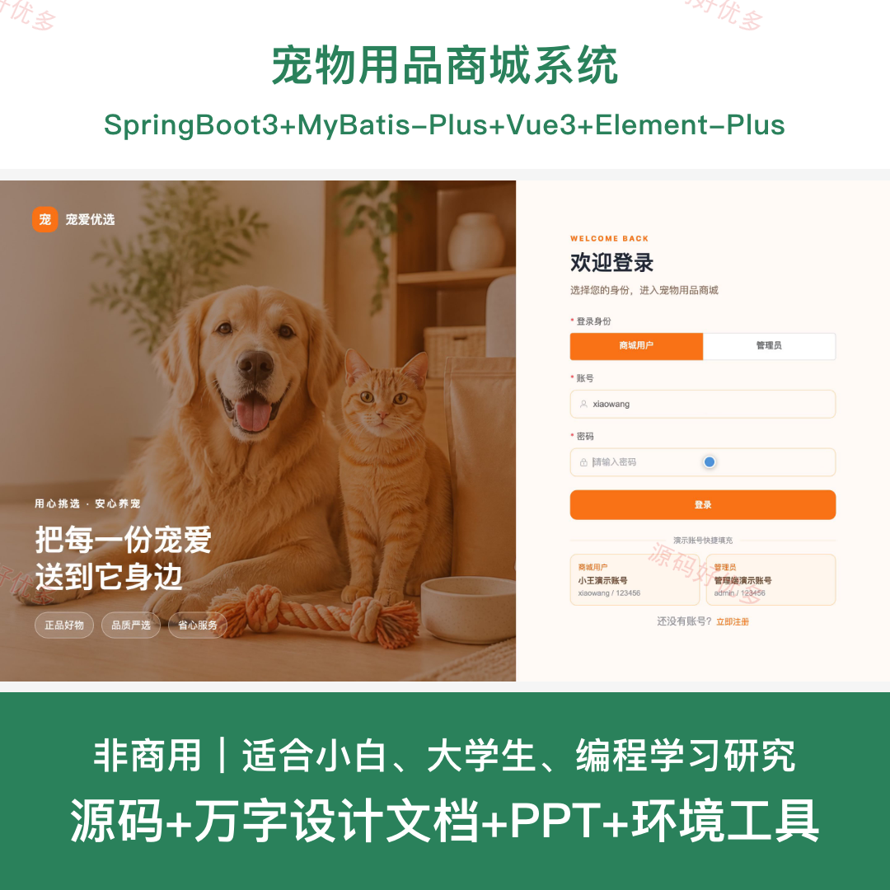
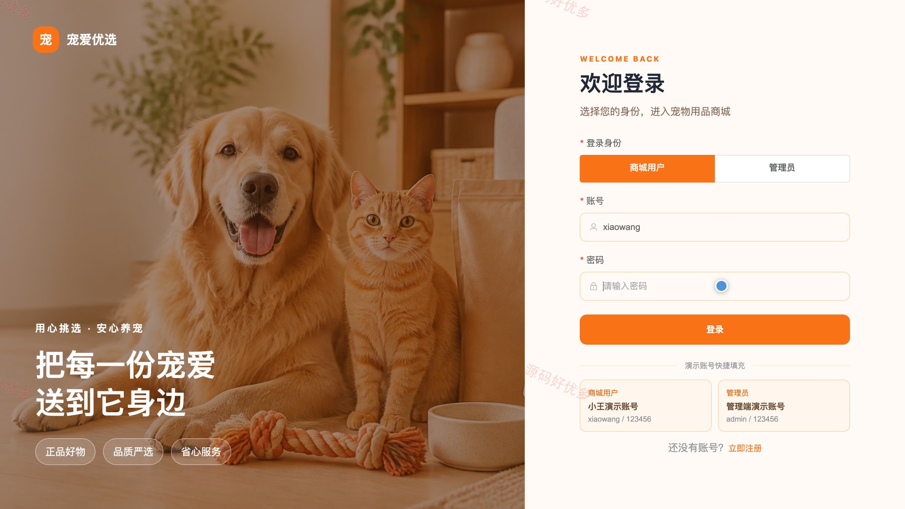
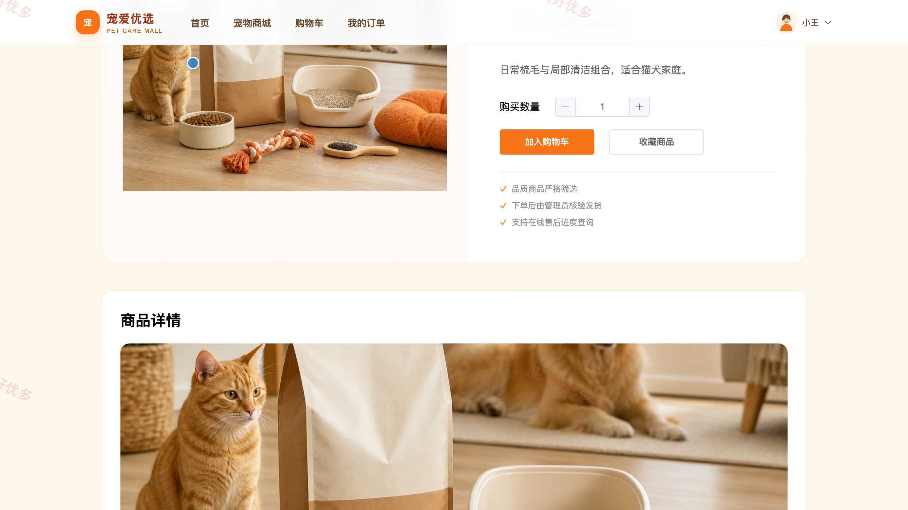
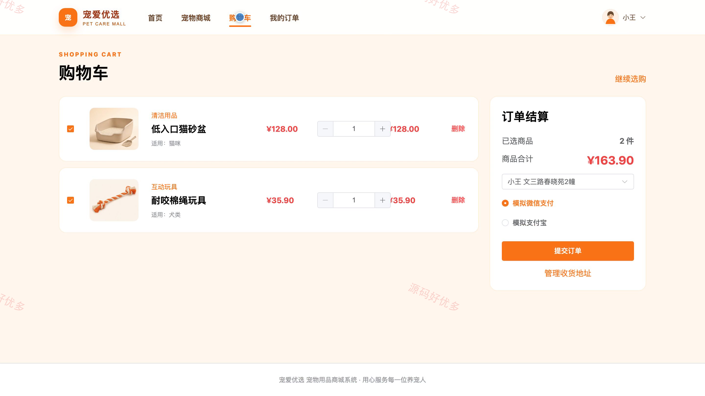
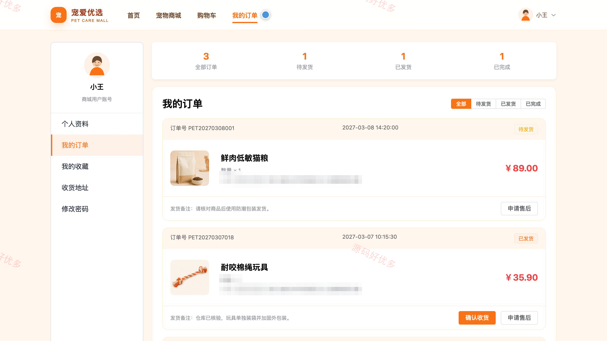
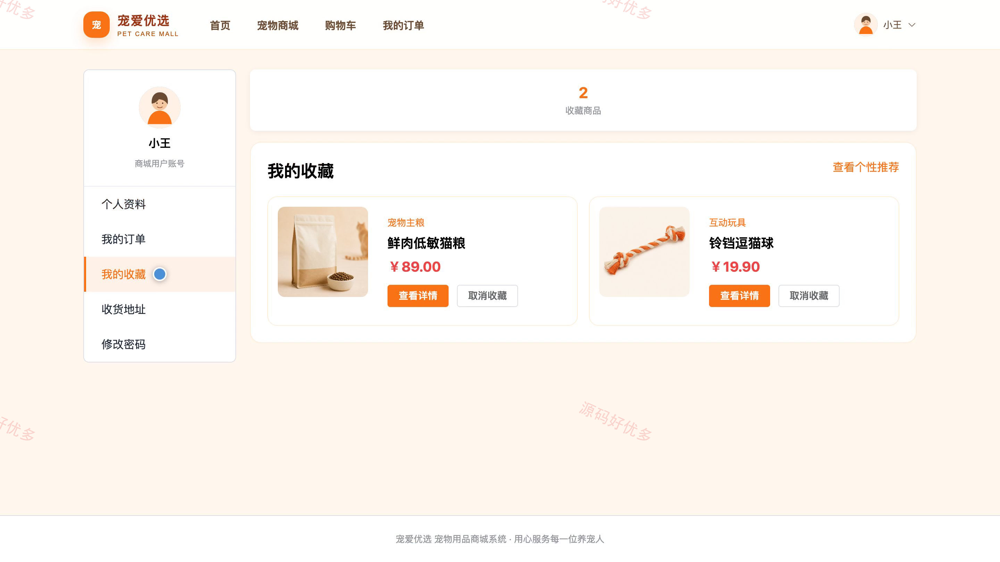
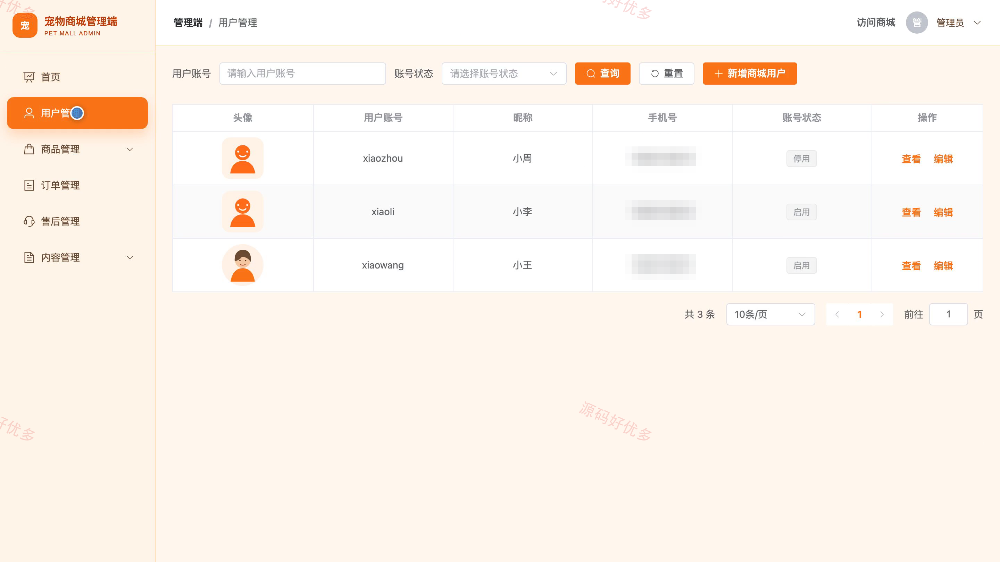
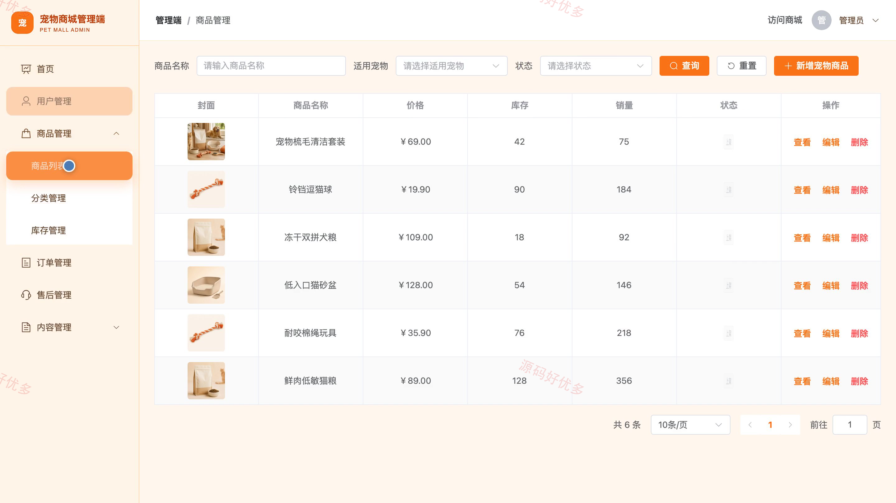

## 源码问题查看主页咨询

### 一、关键词
宠物用品商城、宠物用品选购、宠物食品购买、宠物玩具选购、宠物商品推荐

### 二、作品包含
源码+数据库+万字设计文档+PPT+全套环境和工具资源+本地部署教程

### 三、项目技术
前端技术： Html、Css、Js、Vue3.4、Element-Plus
后端技术：Java、SpringBoot3.2.0、MyBatis-Plus

### 四、运行环境（以下版本亲测，其他版本兼容性请自行测试）
开发工具：IDEA/eclipse + VSCODE

数据库：MySQL5.7+（共14张表）

数据库管理工具：Navicat10以上版本

环境配置软件： JDK17 + Maven

前端Nodejs：20

浏览器：谷歌浏览器

### 五、项目介绍
项目编号：bs068A

宠物用品商城系统面向商城用户和管理员，覆盖宠物用品分类检索、商品收藏、购物车结算、订单跟踪、收货地址、评价推荐，以及后台商品库存、订单发货、售后审核和商城内容维护等业务。

角色：商城用户、管理员

商城用户功能：宠物用品浏览与收藏、购物车与订单结算、订单状态与确认收货、商品评价、个性推荐、收货地址管理、个人资料与密码管理、商城公告浏览。

管理员功能：经营数据看板、商城用户管理、商品分类与库存管理、订单发货管理、售后审核处理、商品评价管理、轮播图与商城内容管理、个人资料与密码管理。

### 六、运行截图

